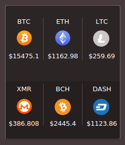

ConkyCryptoCoins
================

A Conky widget for monitoring crypto currencies.

### Installation:

* Install **conky**, **curl** and **jq**.

* Make sure you have the **Droid Sans** font installed.

* After download it place the folder to home directory.Then Run the ConkyStart.sh file.Enjoy:D

### Screenshot:

